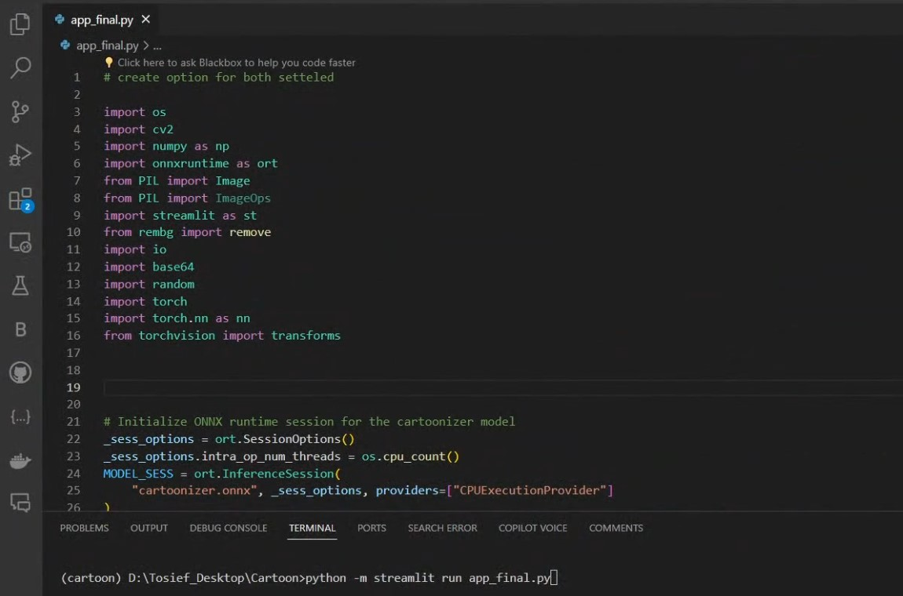
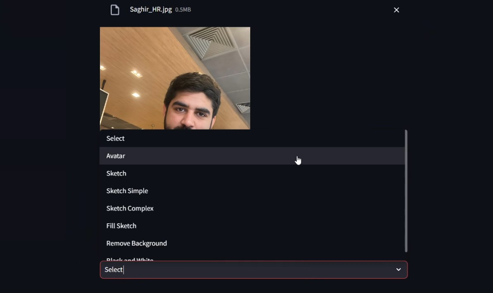
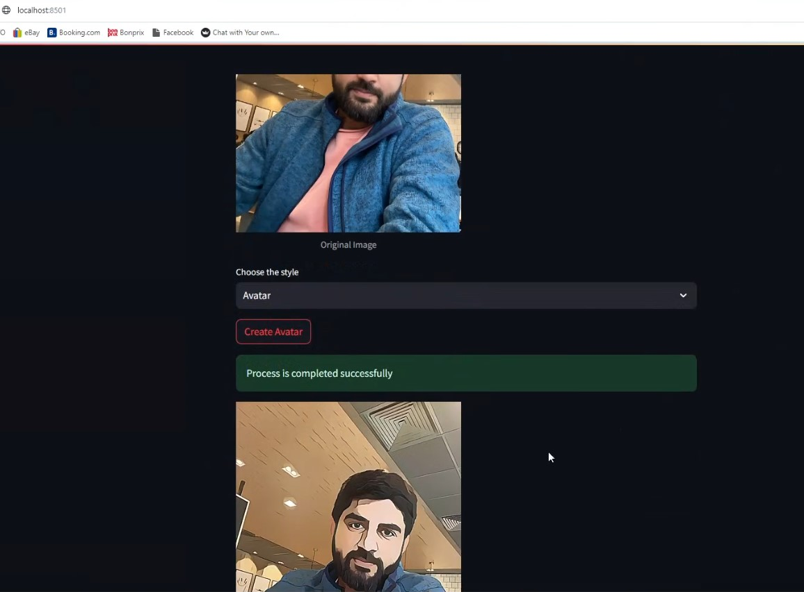
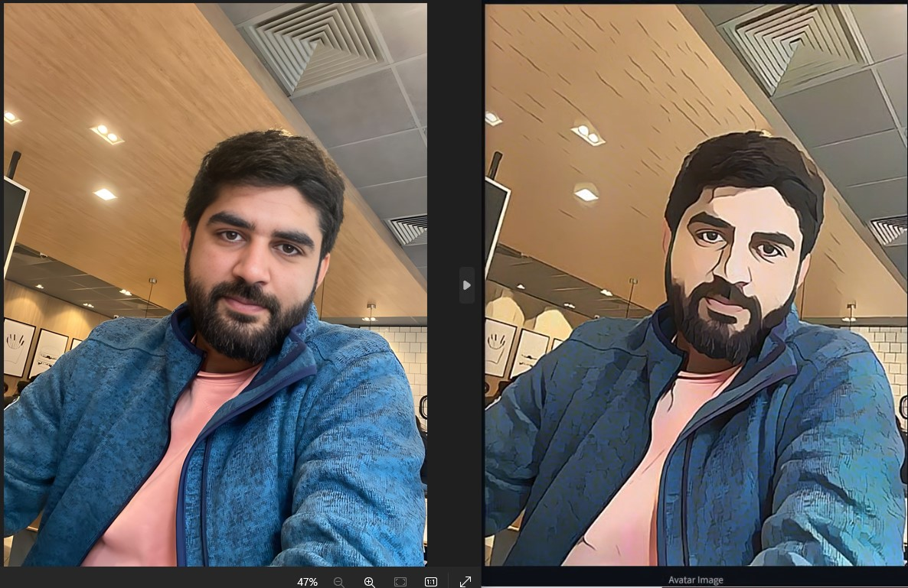
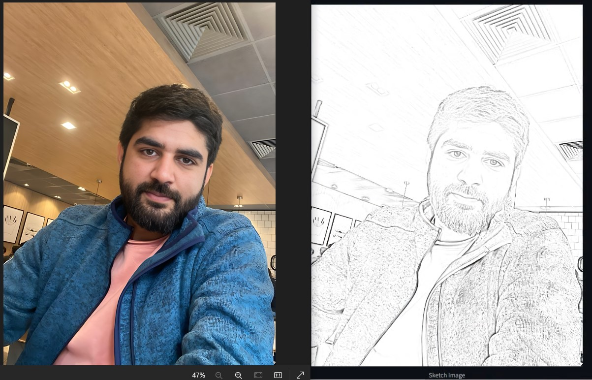
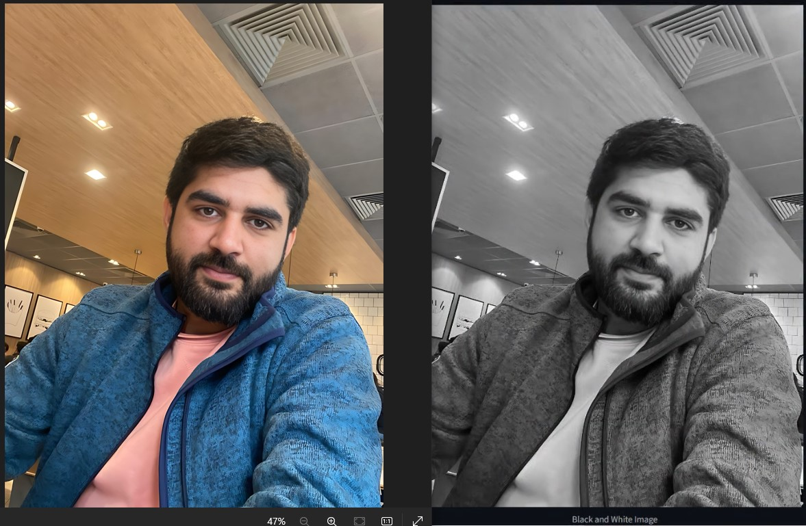
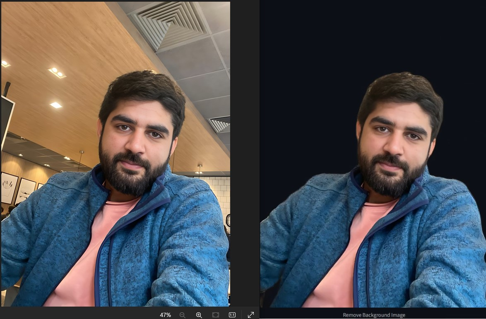
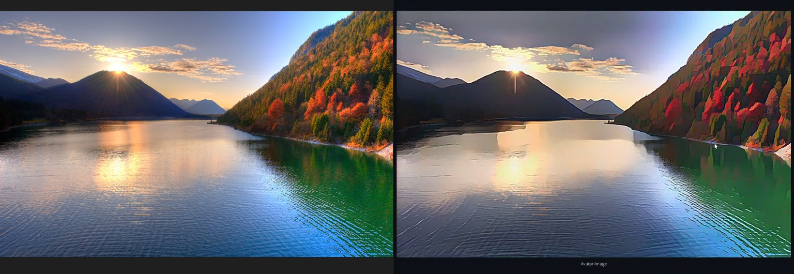
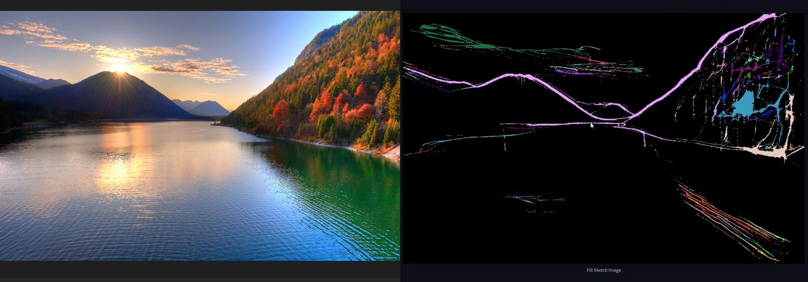

"# Tosief-s-Artistic-Toolkit" 

## **Backend Code for Image Transformation App**
### **This snapshot displays the backend Python code in an IDE, highlighting the initial setup and import statements for various libraries essential for image processing and transformation operations. The code snippet shows the preparation for a machine learning model, likely used to cartoonize images.**

## **Main Interface of the Artistic Image Toolkit**
### **The image shows the main user interface of the Artistic Image Toolkit hosted on a local server. This interface welcomes users and offers them the option to upload images for transformation, emphasizing the app's capability to convert images into different artistic styles using AI.**

## **Error in Image Processing**
### **This image captures an error scenario within the Artistic Image Toolkit, where an image could not be processed successfully. It's important for demonstrating the app's error handling capabilities.**

## **Avatar Style Image Transformation Result**
### **This snapshot shows the successful transformation of a user's uploaded photo into an 'Avatar' style using the toolkit. It features a before and after comparison, showcasing the app's effectiveness in stylizing images.**

## Avatar Style Image Transformation Result
This snapshot shows the successful transformation of a user's uploaded photo into an 'Avatar' style using the toolkit. It features a before and after comparison, showcasing the app's effectiveness in stylizing images. The left side displays the original color image of a person in a casual indoor setting, while the right side presents a stylized avatar version, emphasizing bold colors and outlines to create a distinctive artistic effect.

## **Sketch Style Image Transformation Result**
### **The snapshot displays the app's capability to convert a photo into a 'Sketch' style. It shows a side-by-side comparison of the original and transformed image, emphasizing the detailed sketch lines and artistic shading.**

## **Black and White Image Transformation**
### **This image shows the transformation of a color photo into a black and white version, illustrating the app's ability to apply classic black and white filters effectively. The left side displays the original color image, portraying a person in a casual setting, while the right side offers a dramatic black and white rendition, emphasizing texture and contrast.**

## **Background Removal Transformation**
### **Demonstrates the app's feature to remove the background from an uploaded image, showing the original and the result side by side. This feature helps users focus on the main subject of the image without any background distractions.**

## **Sketch and Simple Sketch Style Transformations**
### **This snapshot presents a comparison between two different sketch styles applied to a photo. It shows the versatility of the app in providing various artistic transformations, from detailed sketches to simpler, more abstract versions.**

## **Artistic Transformation of a Lakeside Sunset**
### **This image captures the transformation of a breathtaking lakeside sunset into an Avatar-style artistic rendition. The left side of the image showcases the natural beauty of the setting sun over a serene lake, while the right side displays a vibrant, color-enhanced version that highlights the artistic capabilities of the image transformation toolkit.**

## **Abstract Sketch Transformation of a Sunset Scene**
### **This panoramic image depicts a stunning lakeside sunset, artistically transformed into a colorful, abstract sketch. The original photo shows a tranquil sunset with vivid autumn colors, while the right side reveals a bold, stylized sketch that accentuates the dynamic contours and textures of the landscape, showcasing the toolkit's ability to creatively reinterpret natural scenes.**

